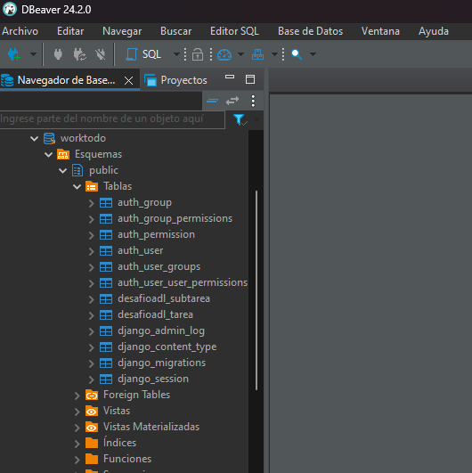
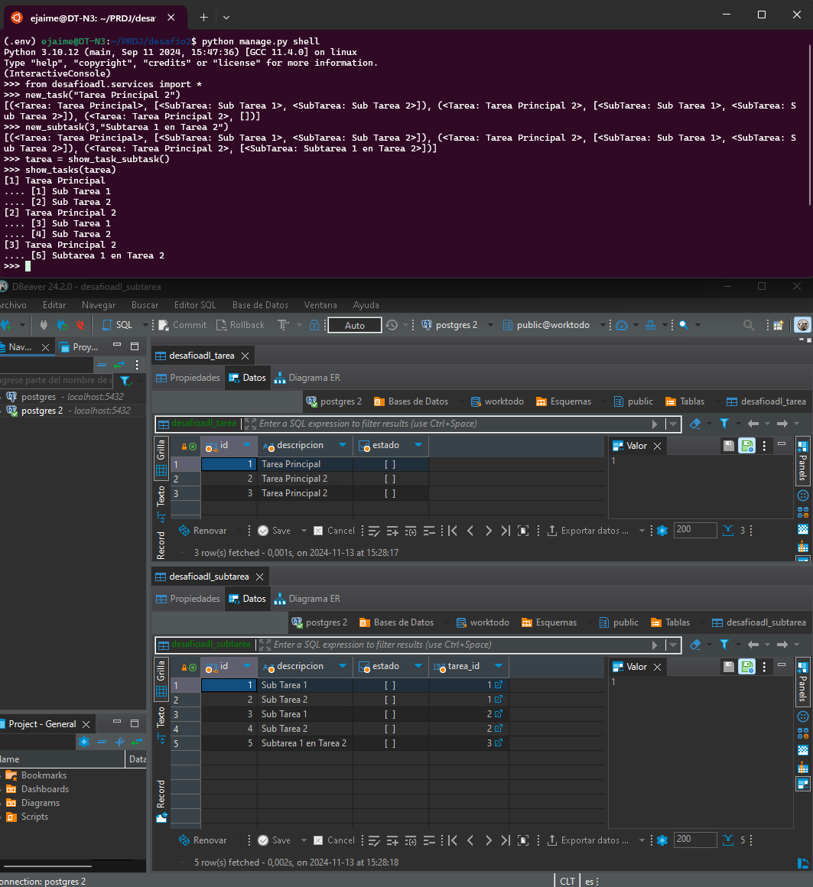

# Proyecto de Administración de Tareas - Desafío 2

Este proyecto de Django se desarrolló como parte de un desafío para la gestión de tareas y subtareas. La aplicación permite crear, visualizar y eliminar tareas y subtareas relacionadas, y también incluye la lógica de servicios en un archivo separado.

## Descripción del Proyecto
El proyecto se compone de una aplicación de Django llamada **desafioadl** dentro de un proyecto principal llamado **desafio2**. Se utiliza SQLite o PostgreSQL como base de datos.

### Modelos
1. **Tarea**:
   - `id`: Identificador autonumérico.
   - `descripcion`: Campo de texto que describe la tarea.
   - `estado`: Campo booleano que indica si la tarea está completada o no.

2. **SubTarea**:
   - `id`: Identificador autonumérico.
   - `descripcion`: Campo de texto que describe la subtarea.
   - `estado`: Campo booleano que indica si la subtarea está completada o no.
   - `tarea`: Relación `ForeignKey` a la clase `Tarea`.

### Archivo de Servicios
El archivo `services.py` contiene la lógica de negocio, incluyendo funciones para:
- Recuperar tareas y subtareas.
- Crear nuevas tareas y subtareas.
- Eliminar tareas y subtareas.
- Imprimir en pantalla las tareas y subtareas de manera ordenada.

## Capturas de Pantalla
### 1. Captura de la Base de Datos (`bbdd.png`)

> Esta imagen muestra la base de datos creada con las tablas `Tarea` y `SubTarea`.

### 2. Resultados de la Ejecución (`result.png`)

> Esta captura ilustra la correcta ejecución de las migraciones y de las funciones de `services.py` desde la shell de Django, incluyendo la impresión de las tareas y subtareas.

## Requisitos
- Entorno WSL - Ubuntu (Opcional)
- Python 3.10.12
- Django 5.1.2
- SQLite o PostgreSQL

## Instalación y Ejecución
1. **Clonar el repositorio**:
   ```bash
   git clone https://github.com/DevilAbbath/desafio2task
   cd desafio2
2. **Instalar dependencias**:
   ```bash
   pip install -r requirements.txt

3. **Realizar migraciones**:
   ```bash
   python manage.py migrate

4. **Ejecutar el servidor de desarrollo**:
   ```bash
   python manage.py runserver

## Uso de services.py
Ejecuta la shell de Django para probar las funciones:

    python manage.py shell

    from desafioadl.services import *

    # Crear y listar tareas y subtareas
    new_task("Tarea de ejemplo")
    new_subtask(1, "Subtarea de ejemplo")
    show_tasks(recupera_tareas_y_sub_tareas())
